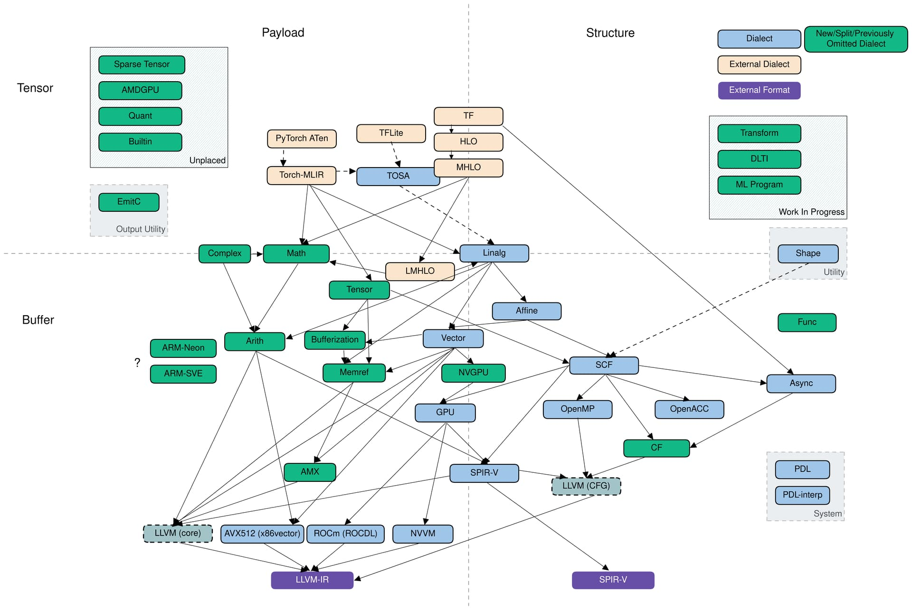
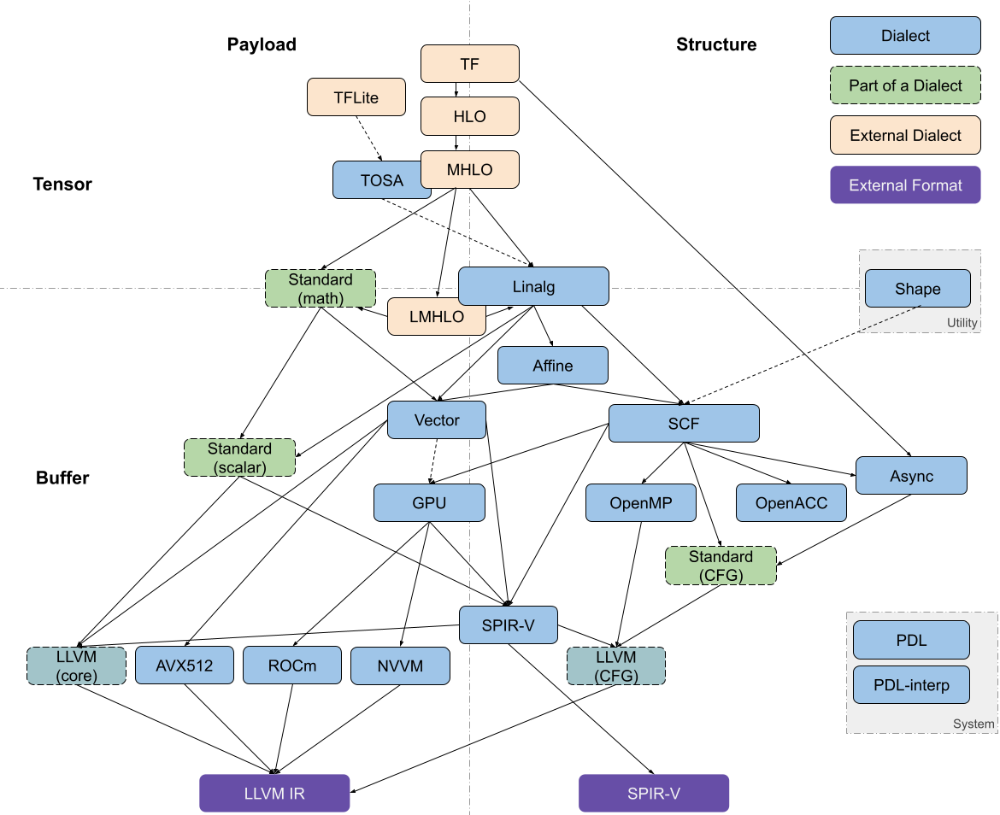

# MLIR总结

### 1. 背景

在深度学习领域，各种框架使用不同的中间表示（IR）来表示模型结构和语义。例如，`Pytorch`引入了`TorchScript`作为其IR，用户可以使用Python编写的代码训练模型然后利用JIT将模型（Module）转换为语言无关的模型（TorchScript）。然而，存在一些普遍的问题，包括IR数量过多、语法差异大导致的代码复制困难、以及直接从高级语言转换为低级IR的挑战。针对上述问题，LLVM团队提出MLIR（Multi-Level Intermediate Representation）框架由，强调编译器基础设施的可重用性和可扩展性，以解决现有IR存在的问题。

### 2. MLIR框架

#### 2.1概念

MLIR 最初是由LLVM社区发起, 旨在解决编译器领域中不同层次之间缺乏通用性和互操作性的问题。其设计一套可复用的编译管线，为编译器和工具构建多层次的中间表示。
针对IR语法差异大的问题，MLIR提出了Dialect，一旦某种IR学会Dialect，就可以基于这种语言将其重写为MLIR。Dialect将所有IR都放在了同一个命名空间里面，分别对每个IR定义对应的产生式以及互相转化的操作。
针对直接从高级语言转换为低级IR比较困难的问题，MLIR通过Dialect抽象出了多种不同级别的MLIR，且增加了不同Dialect之间的convertion，方便从高层往低层逐渐lowering，方便优化。
MLIR项目定义一套 Dialect Translation Graph如下：

#### 2.2 Dialect

##### 2.2.1 引入

编译程序的过程中，要经过一系列的抽象以及分析，通过Lowering Pass来实现IR的转换。因此MLIR引入Dialect，各种IR可以转换为对应的MLIR Dialect, 以此优化IR间转换的性能，同时提高了其拓展性。

##### 2.2.2 多层级

MLIR通过Dialect抽象出多种不同层级的MLIR，并增加了不同Dialect之间的转换。这使得从高层到低层的逐步降低更为方便，有利于进行优化。

这是一张展示了不同层级的Dialect的图片，其中最上层的是用来描述模型的，原始模型有一个对应的Dialect来描述模型的结构和语义，比如图中所示的tensorflow dialect,而中层则是用于逐层lowering的dialect,高层和低层的dialect处于MLIR系统的边界,需要描述MLIR系统之外的东西，而中间层无需满足这些，他们的主要功能是逐层lowering，让每层之间进行的动作尽可能细微化，方便新的语言的产生，最后则是底层输出的mlir，目前已产生的有两个dialect，分别是llvm dialect和spv dialect，对导出到外部系统做准备，这些dialect都是由中间层逐层conversion来的。

##### 2.2.3 分类
[Codegen Dialect Overview](https://discourse.llvm.org/t/codegen-dialect-overview/2723/1)描述了不同dialect之间的关系，我们总结如下：

这张图描述了MLIR的dialect分类，两个坐标轴分别为tensor/buffer和payload/structure

tensor/buffer维度是指dialect主要数据类型是按照机器学习中的Tensor表示的，还是底层编译器中的Memory Buffer表示的。很多dialect的操作既可以基于Tensor，也可以基于Buffer。

payload/structure维度是：payload表示dialect中操作描述执行什么计算（What）；structure表示Dialect中操作描述如何执行计算（How）。比如Math Dialect描述执行什么计算，属于payload类型，SCF Dialect描述了如何执行计算，属于structure类型。

这张图中有以下几个主要的dialect:

Linalg Dialect: 既可以将tensor作为操作数，也可以将buffer作为操作数.实际应用中外部Dialect很多情况下会先转换到Linalg Dialect再执行后续优化。Linalg op的本质是完美嵌套循环(perfect loop nest),Linalg op通过其indexing map来指定循环变量如何访问操作数。Linalg op region内的操作则指定了循环内部所进行的计算。

Vector Dialect：对SIMD模型的抽象，作为一种向量的中间表示，可以被转换到不同Target对应的底层表示，从而实现Tensor在不同模型的支持。

Affine Dialect：主要包含了多维数据结构的控制流操作，比如：多维数据的循环和条件控制，存储映射操作等。其目标是实现自动并行化、用于局部改进的循环融合和平铺，以及 MLIR中的循环矢量化。

SCF(Structured Control Flow)Dialect：可以进行并行的for和while循环以及条件判断。通常Affine和Linalg会降低到SCF后再转化为更底层的CFG来进行

##### 2.2.4 转化过程

MLIR中的Dialect之间存在复杂的转换关系。以Tensorflow为例，从TF Dialect到HLO Dialect，再到MHLO Dialect，涵盖了从高层到底层的优化和转换过程。同时，对标量运算和Tensor运算进行不同的转换流程，最终达到底层表示。标量运算被转换为Standard中的基本数学运算算子，进而下降到LLVM Dialect；控制流图也被转换到对应的Standard CFG中，进而下降到LLVM的CFG；Tensor运算部分被转换到Linalg，进而转化为其他的dialect。

### 3.缺陷

在调研中发现，MLIR虽然提供了便捷的基础设施搭建框架，但也存在一些缺陷。最主要的问题在于IR的不完备性导致碎片化，即: 在不同框架的算子间存在细微区别，但在统一时需要加入大量的转换操作，使简单的算子复杂化。而因MLIR本身的设计依靠多个IR的路径实现从前端到后端的转换，使这个问题尤其显著。这里的不同算子之间存在细微区别具体来说，比如A框架有一个A算子，B框架也有一个B算子，两个算子各包含一些特殊情况，于是MLIR里出现了一个更加通用的X算子，包括A/B框架算子的并集。当X算子往A/B框架转换的时候，这种更加通用的X算子往往没法简单用一个算子实现，需要增加一些其他的算子组合起来。造成的结果就是一个常见的模型经过一系列conversion之后，原来一些简单的算子变得越来越复杂，导致编译优化pass更难运行。

#### 3.1 潜在后果

一个新的高层模型想要接入MLIR生态，并不是转换成任意一个层级的IR这么简单，而是需要支持整个生态从顶层到底层LLVM之间的一个完整截面,那么随着MLIR整个生态的不断膨胀，这个截面是会越来越大，且中间能供厂商复用的东西也很少，复用已有的IR和translator来降低开发全流程可能舍近求远。现有的一些例子看出，最后实际上只能复用一些顶层的HOL和靠近LLVM底层的一些IR，中间的流程都需要厂家自己打造，无法复用，导致MLIR的生态也难以建立，而这个是以碎片化IR转变方式进行的MLIR体系较难克服的一个问题。

### 4.改进

### 5.结论

综合以上调研结果，MLIR作为一个多层次中间表示的框架，在提高互操作性和转换便捷性方面具有显著优势。然而，其生态系统的碎片化和IR的不完备性问题需要进一步解决，以推动MLIR在深度学习领域的广泛应用。未来的发展方向可能包括优化IR的设计，提高生态系统的统一性，以及寻找更有效的方式来处理不同层次的抽象。