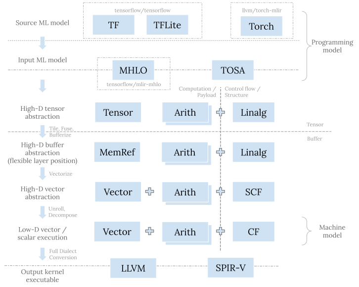

# MLIR

  - [1 背景](#1-背景)
  - [2 MLIR框架](#2-mlir框架)
    - [2.1 MLIR简介](#21-mlir简介)
    - [2.2 Dialect](#22-dialect)
       - [2.2.1 引入](#221-引入)
       - [2.2.2 多层级](#222-多层级)
       - [2.2.3 分类](#223-分类)
       - [2.2.4 转化过程](#224-转化过程)
       - [2.2.5 独立性](#225-独立性)
    - [2.3 编译流程](#23-编译流程)
  - [3 应用](#3-应用)
    - [3.1 tensorflow graph](#31-tensorflow-graph)
    - [3.2  多面体代码生成](#32--多面体代码生成)
    - [3.3 Fortran IR](#33-fortran-ir)
    - [3.4 领域特定编译器](#34-领域特定编译器)
  - [4 缺陷](#4-缺陷)
    - [4.1 潜在后果](#41-潜在后果)
    - [4.2 权衡](#42-权衡)
  - [5.结论](#5结论)

### 1 背景

在深度学习领域，各种框架使用不同的中间表示（IR）来表示模型结构和语义。例如，`Pytorch`引入了`TorchScript`作为其IR，用户可以使用Python编写的代码训练模型然后利用JIT将模型（Module）转换为语言无关的模型（TorchScript）。然而，存在一些普遍的问题，包括IR数量过多、语法差异大导致的代码复制困难、以及直接从高级语言转换为低级IR的挑战。针对上述问题，LLVM团队提出MLIR（Multi-Level Intermediate Representation）框架由，强调编译器基础设施的可重用性和可扩展性，以解决现有IR存在的问题。

### 2 MLIR框架

#### 2.1 MLIR简介

MLIR， 最初是由LLVM社区发起, 是一个可扩展重用的编译基础框架。其设计一套可复用的编译管线，为编译器和工具构建多层次的中间表示。MLIR的出现旨在解决处理以下问题:
* 处理软件碎片化
* 为面向异构硬件提供编译支持
* 连接多种已有编译器，聚合其优势
* 降低编译器开发难度

MLIR项目定义一套 Dialect Translation Graph如下：

#### 2.2 Dialect

##### 2.2.1 引入

编译程序的过程中，要经过一系列的抽象以及分析，通过Lowering Pass来实现IR的转换。针对IR语法差异大的问题，MLIR提出了Dialect,即方言。Dialect可以理解为框架的中间层。Dialect将所有IR都放在了同一个命名空间里面，分别对每个IR定义对应的产生式以及互相转化的操作。所以对于其他编译器中的IR可以转化为Dialect而直接接入到生态中,优化IR的转化性能,具有较高的拓展性。

##### 2.2.2 多层级
针对直接从高级语言转换为低级IR比较困难的问题,MLIR通过Dialect抽象出多种不同层级的MLIR,并增加了不同Dialect之间的转换，这使得从高层到低层的逐步降低更为方便。

这是一张展示了不同层级的Dialect的图片，其中最上层的是用来描述模型的，原始模型有一个对应的Dialect来描述模型的结构和语义，比如图中所示的tensorflow dialect,而中层则是用于逐层lowering的dialect,高层和低层的dialect处于MLIR系统的边界,需要描述MLIR系统之外的东西，而中间层无需满足这些，他们的主要功能是逐层lowering，让每层之间进行的动作尽可能细微化，方便新的语言的产生，最后则是底层输出的mlir，目前已产生的有两个dialect，分别是llvm dialect和spv dialect，对导出到外部系统做准备，这些dialect都是由中间层逐层conversion来的。

##### 2.2.3 分类
[Codegen Dialect Overview](https://discourse.llvm.org/t/codegen-dialect-overview/2723/1)描述了不同dialect之间的关系，我们总结如下：

这张图描述了MLIR的dialect分类，两个坐标轴分别为tensor/buffer和payload/structure

tensor/buffer维度是指dialect主要数据类型是按照机器学习中的Tensor表示的，还是底层编译器中的Memory Buffer表示的。很多dialect的操作既可以基于Tensor，也可以基于Buffer。

payload/structure维度是：payload表示dialect中操作描述执行什么计算（What）；structure表示Dialect中操作描述如何执行计算（How）。比如Math Dialect描述执行什么计算，属于payload类型，SCF Dialect描述了如何执行计算，属于structure类型。

这张图中有以下几个主要的dialect:

* **Linalg Dialect**: 既可以将tensor作为操作数，也可以将buffer作为操作数.实际应用中外部Dialect很多情况下会先转换到Linalg Dialect再执行后续优化。Linalg op的本质是完美嵌套循环(perfect loop nest),Linalg op通过其indexing map来指定循环变量如何访问操作数。Linalg op region内的操作则指定了循环内部所进行的计算。

* **Vector Dialect**：对SIMD模型的抽象，作为一种向量的中间表示，可以被转换到不同Target对应的底层表示，从而实现Tensor在不同模型的支持。

* **Affine Dialect**：主要包含了多维数据结构的控制流操作，比如：多维数据的循环和条件控制，存储映射操作等。其目标是实现自动并行化、用于局部改进的循环融合和平铺，以及 MLIR中的循环矢量化。

* **SCF(Structured Control Flow)Dialect**：可以进行并行的for和while循环以及条件判断。通常Affine和Linalg会降低到SCF后再转化为更底层的CFG来进行

##### 2.2.4 转化过程

MLIR中的Dialect之间存在复杂的转换关系。以Tensorflow为例，从TF Dialect到HLO Dialect，再到MHLO Dialect，涵盖了从高层到底层的优化和转换过程。同时，对标量运算和Tensor运算进行不同的转换流程，最终达到底层表示。标量运算被转换为Standard中的基本数学运算算子，进而下降到LLVM Dialect；控制流图也被转换到对应的Standard CFG中，进而下降到LLVM的CFG；Tensor运算部分被转换到Linalg，进而转化为其他的dialect。

##### 2.2.5 独立性
Dialect的设计使得Dialect具有独立性,在对其中某个模块进行优化的时候不需要考虑其他模块的行为。如当考虑优化算数表达式时,不需要考虑循环展开等方面的优化。
正因如此,dialect的设计理念在于及时做优化,也正因为不需要考虑其他模块,可以适当的降低开发难度。

#### 2.3 编译流程
MLIR的编译流程可以分为三步:
**前端（Frontend）:**
* **源代码输入**：编译过程的开始阶段是从源代码开始。源代码可以是任何编程语言，而 MLIR 的前端负责将其转换为 该语言对应的最顶层dialect形式。
* **词法分析和语法分析**： 源代码经过词法分析和语法分析，将其转换为语法树或其他中间表示。
* **中间表示生成**： 生成 MLIR 表示形式，涉及到创建 MLIR 的 Dialects，这取决于编译器的设计和领域特定语言的需求。

**中间层(Intermediate Layer):**

* **通用优化:**  MLIR 提供了通用的中间表示，允许在这一层进行通用的编译器优化，例如常量传播、死代码删除、循环优化等。这些优化可以跨越不同的前端和后端。
* **Dialect 优化：** 针对特定的 MLIR Dialects 进行优化，以更好地利用领域特定语言的特性。每个 Dialect 可能有自己的优化规则和转换规则。
* **转化:** 多个中间层的Dialect在执行自己的优化和翻译后向下抽象,如`2.2.4节`所述。 

**底层(underlying)：**
此时原模型已经被转换为最底层表示如 LLVM Dialect等。
* **目标代码生成：** 根据编译框架和需求转换为所需要的底层IR如 LLVM IR。
* **硬件特定优化：** 针对目标硬件平台的优化，以确保生成的代码能够最大程度地利用目标硬件的性能。

### 3 应用
我们初步调研了MLIR在不同领域的应用，关注MLIR的引入对原方法产生的差异，从而更好地理解其在提高编译器性能、优化代码和促进领域特定语言开发等方面的潜在影响。

#### 3.1 tensorflow graph
MLIR最初的设计是为了机器学习而服务,Tensorflow 是这些框架中的一个例子。

在tensorflow的体系中,除了mlir，其还使用了XLA HLO模块。具体的流图如上图所示。MLIRh和XLA HLO并行存在，XLA有部分转化为MLIR中的MHLO Dialect,部分直接转化为LLVM IR。
在它的表现形式中，节点代表着可以被放到包含特定硬件加速器上的多重设备的计算的高级的数据流计算。MLIR 在 tensorflow 中被用于建模内部表示形式并进行如图1所示的从线性代数优化到采用数据中心硬件加速集群的并行执行的图重定向，从将表示 lowering 到合适的移动设备部署到支持用类似XLA 的工具生成高效的本地代码。

#### 3.2  多面体代码生成
探索加速器的多面体代码生成也是MLIR最初发展的动机之一，其中方言affine dialect是简化的多面体表示形式。引入MLIR后的框架和原框架具有较大的差异:
* **更丰富的类型**
  MLIR结构化的内存引用类型 中有一个 缓存的索引空间到实际的地址空间的布局映射。分隔这两种空间可以改善循环和数据转换的组合，因为对数据布局的修改不会影响到代码，也不会污染依赖关系分析。

* **抽象混合** 
  可以用类型化的静态单赋值来表示 MLIR的仿射循环体。所以对于传统编译器的分析转换过程对MLIR也适用,且可以和多面体转换交错使用。而传统的多面体编译器往往会直接抽象掉这些细节，使得其难以操作一些对象如向量类型。

* **更小的表示差异** 
  类型系统中表示循环迭代顺序的能力是多面体模型编译器的一个核心表现。但是传统的多面体编译器在转换后会将IR提升为与原始IR差异较大的表示形式。因此将变换后的多面体转换为循环具有较复杂的计算难度。而在引入MLIR后使得在低级表示中保留了高级循环结构,大幅度避免了IR的提升变化。

* **更快的编译速度** 
  现有大多数多面体方法并不关注编译速度。这些多面体方法严重依赖指数复杂度的算法，依赖整数线性编程自动推导出循环顺序，依赖多面体扫描算法将IR转换回循环。MLIR的设计目标之一便是编译速度，MLIR采用的方法不依赖多面体扫描，因为循环直接保留在IR中。

#### 3.3 Fortran IR
Fortran IR是针对于LLVM前端"flang"的编译框架。flang使用MLIR支持Fortain特定的优化,如高级循环优化，数组拷贝消除，调用规范等。而这些优化若是直接使用LLVM实现是十分复杂的。结构化的IR中建模语言的高级语义具有非常强大的能力,使用MLIR让flang 的开发者可以将他们的工程资源聚焦在设计他们的领域IR 的表示，而非实现基本的基础架构。
另一方面,MLIR使得对于非Fortron独有的方言可以得到复用,如语言无关的OpenMP 方言可以在Fortron和C语言前端之间共享。当然这也是MLIR本身具有的能力。

#### 3.4 领域特定编译器
考虑到MLIR可重用，模块化的性质，其在开发领域特定的小型编译器时具有较大的优势,使得开发更加的边界,构建成本更加低廉。

### 4 缺陷

MLIR虽然提供了便捷的基础设施搭建框架，但也存在一些缺陷:
* IR不完备性导致的碎片化严重。
* 编译链接的的时间空间开销较大。
* Dialect定义相对复杂，在引入新的Dialect时需要定义新的操作和语义,具有较高的门槛。
* MLIR提供多返回值的IR,而多返回值的IR十分少用,此让数据流的分析更加复杂。

最主要的问题在于IR的不完备性导致碎片化，即: 在不同框架的算子间存在细微区别，但在统一时需要加入大量的转换操作，使简单的算子复杂化。而因MLIR本身的设计依靠多个IR的路径实现从前端到后端的转换，使这个问题尤其显著。
这里的不同算子之间存在细微区别具体来说，比如A框架有一个A算子，B框架也有一个B算子，两个算子各包含一些特殊情况，于是MLIR里出现了一个更加通用的X算子，包括A/B框架算子的并集。当X算子往A/B框架转换的时候，这种更加通用的X算子往往没法简单用一个算子实现，需要增加一些其他的算子组合起来。造成的结果就是一个常见的模型经过一系列conversion之后，原来一些简单的算子变得越来越复杂，导致编译优化pass更难运行。

#### 4.1 潜在后果

一个新的高层模型想要接入MLIR生态，并不是转换成任意一个层级的IR这么简单，而是需要支持整个生态从顶层到底层LLVM之间的一个完整截面,那么随着MLIR整个生态的不断膨胀，这个截面是会越来越大，且中间能供厂商复用的东西也很少，复用已有的IR和translator来降低开发全流程可能舍近求远。现有的一些例子看出，最后实际上只能复用一些顶层的HOL和靠近LLVM底层的一些IR，中间的流程都需要厂家自己打造，无法复用，导致MLIR的生态也难以建立，而这个是以碎片化IR转变方式进行的MLIR体系较难克服的一个问题。

#### 4.2 权衡
上述MLIR存在的问题是其提供高自由度和复用性带来的必然后果。所以对于MLIR的优化实际上是在其特点和性能上做权衡。以碎片化为例,可以通过在中间层加入严格分层或统一一些针对于数据结构传递的上下层方言来改善,但与此同时MLIR的Dialect的灵活性则收到限制。故应根据应用的需求而进行不同的选择，而正真的阶段性的优化则难以实现。

### 5.结论

综合以上调研结果，MLIR作为一个多层次中间表示的框架，在提高互操作性和转换便捷性方面具有显著优势。然而，其生态系统的碎片化和IR的不完备性问题需要进一步解决，以推动MLIR在深度学习领域的广泛应用。未来的发展方向可能包括优化IR的设计，提高生态系统的统一性，以及寻找更有效的方式来处理不同层次的抽象。

### 分工
|组员|工作|占比|
|:--:|:--:|:--:|
|李润时|MLIR 环境配置;MLIR特性等方面调研;共同完成报告|50%|
|梅陶然|MLIR 构造及方言等方面调研;共同完成论文;ppt负责|50%|

